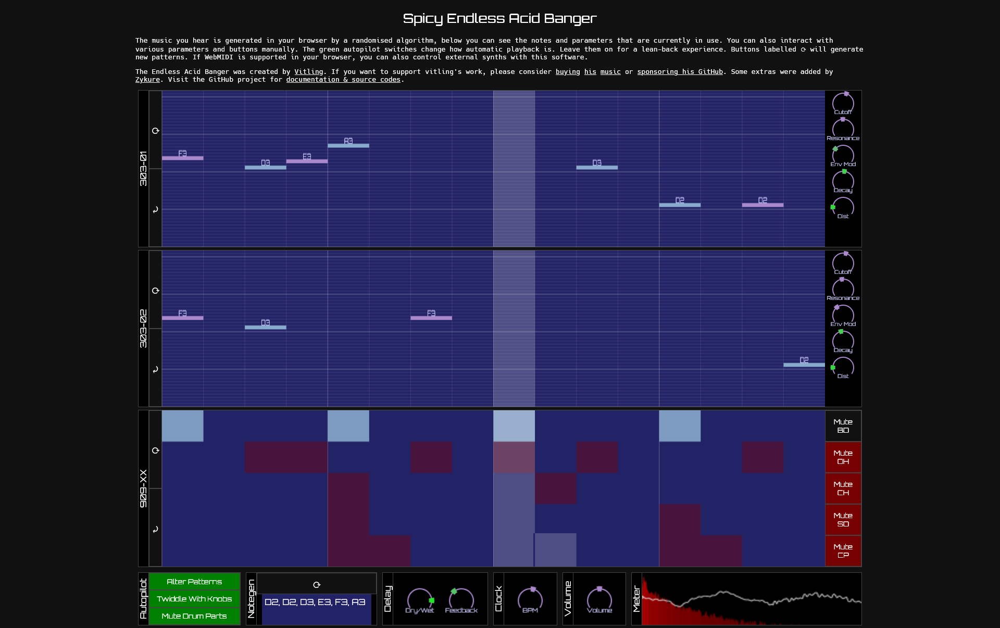

# Spicy Endless Acid Banger

A browser-driven acid synthesizer, written in TypeScript.

Try it here:
* https://io.zykure.de/acid-banger/
* https://zykure.github.io/acid-banger/ [DEMO]

## Overview

The music you hear is generated in your browser by a randomised algorithm.
While playing, you can see the notes and parameters that are currently in use. 
You can also interact with various parameters and buttons manually. 

The green autopilot switches change how automatic playback is. Leave them on for a lean-back experience. 
Buttons labelled ⟳ will generate new patterns. 
If WebMIDI is supported in your browser, you can also control external synths with this software.

The Endless Acid Banger was created by [Vitling](https://www.vitling.xyz/). 
If you want to support vitling's work, please consider [buying](https://music.vitling.xyz/album/long-walks-and-tough-talks) [his](https://edgenetwork.bandcamp.com/album/edge001-spaceport-lounge-music) [music](https://midnight-people.bandcamp.com/album/destiny-ep) or [sponsoring his GitHub](https://github.com/sponsors/vitling). 

Some spicy extras were added by [Zykure](https://github.com/zykure/).
You can support me by buying [my music](https://universe-momentum.bandcamp.com/).

Visit the [GitHub project](https://github.com/zykure/acid-banger/) for documentation & source codes. 
