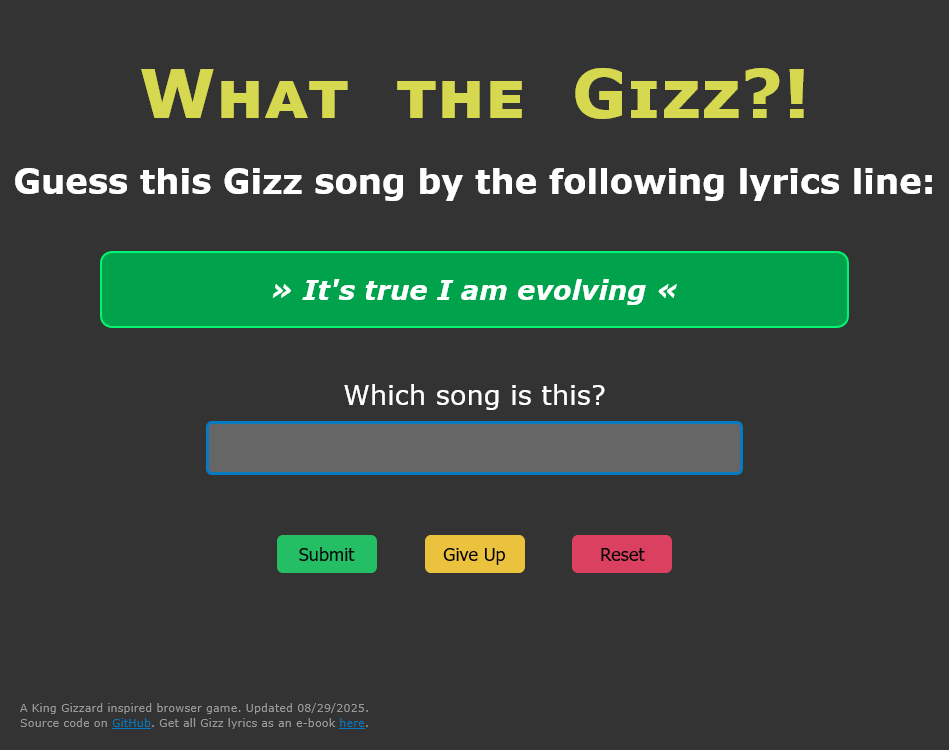

# What the Gizz?!

A King Gizzard inspired browser game. JavaScript and HTML/CSS only.

Try it here:
* https://io.zykure.de/what-the-gizz/
* https://zykure.github.io/what-the-gizz/ [DEMO]

## Overview

This game randomly picks a Gizz song and shows random lines of lyrics.
You need to guess the correct song in as few tries as possible.
If you guessed wrong, a new line from the same song will be shown until none are left.

## Notes

The game is based on my [lyrics e-book](https://github.com/zykure/KGLW-TheBook) project
and uses processed data from its sources to build the lyrics database.
